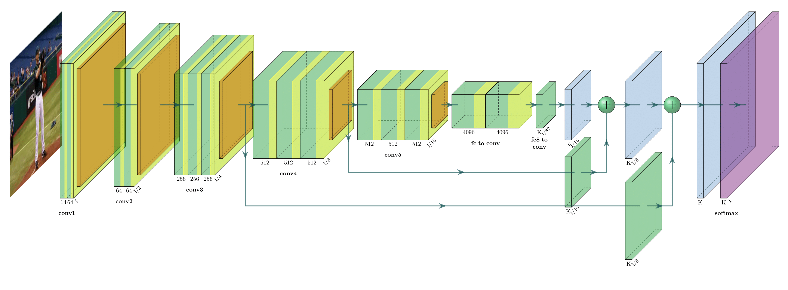
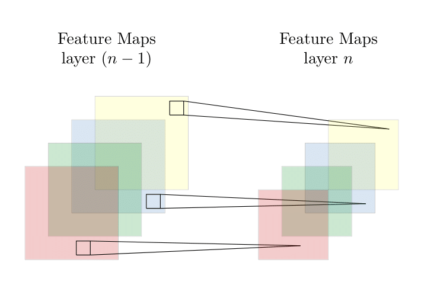
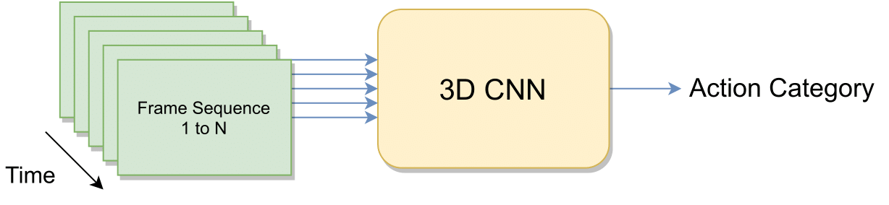

# Convolutional Neural Network

Convolutional Neural Network (CNN, or ConvNet) is one of the most well-known deep learning algorithms which has been commonly implemented in a variety of machine learning tasks. The first presence of modern CNN can date back to late 1990s when LeCun et al. proposed a CNN architecture called LeNet based on MNIST database of handwritten digits, which could handle simple task of digit recognition. Despite its success on digit recognition, LeNet suffers from scalability problem due to limited computation resources, especially Graphics Processing Unit (GPU). In 2012, AlexNet achieved exceptional performance in the ImageNet Large Scale Visual Recognition Challenge, a project evaluating algorithms for object detection and classification based on ImageNet. Ever since the great success of AlexNet, CNN has been showing its unparalleled effectiveness in producing the state-of-the-art results on a wide range of problems in the area of machine learning, including image recognition, semantic segmentation, object detectionand video analysis. 

The figure above indicates an end-to-end CNN architecture as an example. Accordingly, the input and output in CNN are a set of tensors, containing the information from the datasets. For colored image-based datasets, the input is a 2D array containing RGB channels of the image, a 3D array for video-based datasets and a 1D array for an audio input. The output is specifically defined by the task purpose, e.g., action categories represented by class numbers for action recognition. 

CNN is composed of multiple layers of mathematical functionalities such as convolution and pooling. Convolutional layer consist of a set of learnable parameters and is introduced to extract features from raw images by downsampling the input images and detecting high-level features. Pooling is added to downsample the generated feature map further and denoise the feature map by removing anomaly values, e.g., by max pooling. 

Every time we feed input (vectors) to the network, it will be transformed through a series of hidden layers such as convolutional, ReLU and pooling layers and the output will finally be generated from the last fully connected layer. The hidden layers will perform feature extraction while the fully connected layer will produce the desired results such as classified categories from the extracted features in classification tasks. 

Nowadays, CNN has achieved abundant impressive results in a variety of machine learning tasks, particularly in computer vision area. CNN is able to learn representations from the tensor data such as images, and recently it has shown its compelling  performance improvement compared with other approaches. Since CNN has been proved a feasible and efficient method to generate and differentiate between features, it is often implemented for  feature generation and classification.

## 1 Convolutional Layer
The most typical and fundamental component in CNN is convolutional layer. Each convolutional layer is a unit whose parameters consist of a set of learnable kernels and filters where we can assign learnable parameters (weights and biases) to differentiate one object from another given the input and the parameters can be trained with gradient descent and updated periodically. It  consists of linear and non-linear operations, i.e., convolution operation and activation function. Parameter sharing is another critical concept in convolution process, the idea behind which is to accelerate the training process by with less learnable parameters. 

Convolution is one type of linear operation used to extract feature from the input, where the unit takes in input and calculates convolved results by filtering the vector with kernel on receptive fields. As has been described, this convolution will reduce the in-plane dimension compared with the input tensor. Thus, padding such as zero padding is applied to address the issue so that the outermost element of the input tensor can be convolved and the same dimension can be kept after convolution. Moreover, stride, another down-sampling technique to reduce the in-plane dimension by  distance between two successive kernel positions, is often involved in the convolution process. Take an RGB image ($\operatorname{dim}($I$)=\left(n_{H}, n_{W}, n_{C}\right)$) as an example, the convolution By kernel ($ \operatorname{dim}($K$)=\left(f, f, n_{C}\right)$) is defined as: 
\begin{equation}
   \operatorname{conv}\left(I, K\right)\_{x, y} = \sum_{i=1}^{n_{H}} \sum_{j=1}^{n_{W}} \sum_{k=1}^{n_{C}} K_{i, j, k} I_{x+i-1, y+j-1, k}
\end{equation}
 
After convolution, the dimension of the feature map with stride $s$ and padding $p$ is: 

$$\operatorname{dim}(\operatorname{con} v(I, K)) = \begin{cases}
\left(\left\lfloor\frac{n_{H}+2p-f}{s}+1\right\rfloor, \left\lfloor\frac{n_{\mathrm{W}}+2p-f}{s}+1\right\rfloor\right) & s > 0 \\\\
\left(n_{H}+2p-f, n_{W}+2p-f\right) & s = 0
\end{cases}$$

where $|x|$ is the floor function of $x$.

After the convolution, feature maps representing different characteristics of the input tensors will be generated and passed onto next layer, which simulates the response of neuron to a specific stimulus. In the process of convolution, multiple kernels will be applied on the input so that feature maps containing diverse characteristics can be extracted from the input. 

 are applied on the input image or input feature map to generate the output features maps by convolution. ")

Activation function is the non-linear transformation in the network to enable the learning of complex patterns by determining the firing of neurons and their connections to subsequent neurons. It is desirable to include such function in multi-layer networks as they introduce non-linearities which will produce a nonlinear decision boundary to distinguish between inputs. Activation function is able to differentiate between in-plane features and lead to better patterns representation from the input data. The
appropriate activation function can improve the learning process by reducing the training time. Among the most common activation functions, Rectified Linear Unit (ReLU)  has been shown to be preferable since it leads to faster training and better performance than others such as sigmoid and hyperbolic tangent (tanh) function. 
\begin{equation}
    f(x)=\max (0, x)
\end{equation}
To overcome the potential disadvantage of non-differentiable problem of ReLU at zero, Leaky ReLU is proposed so that the weights can be updated in negative region. 

The objective of convolution layer is to extract high-level features such as textures from the input image, which often involves multiple convolutional layers where the first several layers are supposed to capture some low-level features like edges and the last several ones will capture high-level features like textures.
## 2 Pooling Layer
Similar to convolutional layer, pooling layer is responsible for down-sampling the representation size spatially, which will
build connection between adjacent local receptive field, and reduce the number of in-plane dimension further. Except from dimensionality reduction, it will also help extract rotational and positional invariant features from the input. There are two common pooling operations, including a linear operation average pooling and non-linear operation max pooling. Regularly, max pooling can outperform average pooling since it can denoise the representation by ignoring the anomaly values. 

## 3 Fully Connected Layer
After the feature extraction process by the previous layers, there will be one or more fully connected layers, also known as dense layers, which typically have the same number of output nodes as the number of classes and will perform high-level reasoning by building full connections to all activations from previous layers. The softmax function is often attached into the fully connected layer, which  is a function that transforms a vector of $K$ real values into a vector of $K$ real values that sum to $1$. By adding fully connected layers, the network is able to learn a possibly non-linear function in the space of features generated by previous operations. 
## 4 What's more
The motivation for deep CNN architectures is based on the assumption that the deeper network is able to  approximate the target function with more nonlinear mappings and diverse feature hierarchies and deeper networks can represent certain classes of function more efficiently than shallower ones. However, training a deeper networks is always a challenging task, and there have been a number of attempts trying to solve issues brought by deeper network such as gradient diminishing. Deeper CNN can theoretically perform well on complicated tasks. However, they may suffer issues brought by the increase of depth, including performance degradation, gradient vanishing, or explosion problems. 

ResNet, short for Residual Network, is one type of CNN that was firstly introduced in 2015, which revolutionised CNN by introducing the concept of residual learning in CNN training process to address the problems brought by deeper network. The most significant intuition behind ResNet is by introducing residual block which creates shortcut that can skip one or more layers. The reason why skip connection is introduced is that we want to overcome gradients vanishing by reusing activations from a previous layers so that the adjacent layers can learn weights. Apart from avoiding gradient vanishing, residual block will also speed the training process since skipping can reduce the network and lead to less parameter that require back propagation. Consequently, training much deeper networks becomes  possible and the performance of deeper network is supposed to be at least as good as a shallower one. 

 and a Residual Block (right)")

As the figure indicates, there is an extra identity mapping from the input to the output so that the output $y_l$ becomes $f(x_l, w_l) + x_{l}$ instead of $f(x_l, w_l)$ by residual block, where $x_{l} = ReLU(y_{l-1})$. 
The intuition behind the residual block is that sometimes identity mapping is optimal and it would be difficult for a set of non-linear layers to fit an identity mapping so that the residual blocks make it easier to optimize the residual function $f(x_l, w_l) + x_{l}$ than $f(x_l, w_l)$. Moreover, the involvement of residual block also reduces the error rate brought by much deeper network structure. 

The reason for choosing ResNet over other popular CNN architectures is that ResNet can be more efficient as it requires less time in training with less parameters to learn and there are a variety of ResNet which is flexible for us to conduct further research. Since there is action recognition task on per-frame data, ResNet can be an effective approach. 

CNN has been developing in computer vision area in decades. One of the most popular approaches of CNN-based action recognition is two-stream CNN with 2D convolutional kernels, which combines RGB and incorporated optical flow frames as appearance and motion information. The efficiency of two-stream CNN is proved by increase of action recognition accuracy. Thereafter, a number of methods based on the two-stream CNN are proposed to
improve action recognition performance. 

CNN with spatial-temporal 3D convolutional kernels, which can learn spatial-temporal feature representation from raw videos, was actually proposed many years ago but it cannot achieve a compelling results as two-stream CNN does as a result of relatively small-scale of existing video datasets for optimizing the huge number of parameters in 3D CNN, which are much more than those in a 2D CNN. With more large-scale video datasets released, 3D CNN has recently achieved impressive performance on a variety of tasks based on large-scale datasets. Despite training a 3D CNN requires more computation resources and can be difficult to optimize, the use of recent large-scale video datasets enables the training and significantly improves their performance. 3D ResNet is proposed based on ResNet. The main difference is that 3D ResNet has different number of dimensions of convolutional kernels and pooling, which is able to take a sequence of images as input.   

As has been shown, the input is a sequence of frames by time order and the output is the most possible categories of the frame sequence. By adding extra dimension of kernels and pooling, the network is able to learn not only spatial features but also temporal features from the input sequence so that the relationship within the sequence can be detected and utilized. These 3D CNN are intuitively effective
because such 3D convolution can be implemented to directly extract spatial-temporal features from raw videos rather than generating and combining optical flow in two-stream CNN. 

